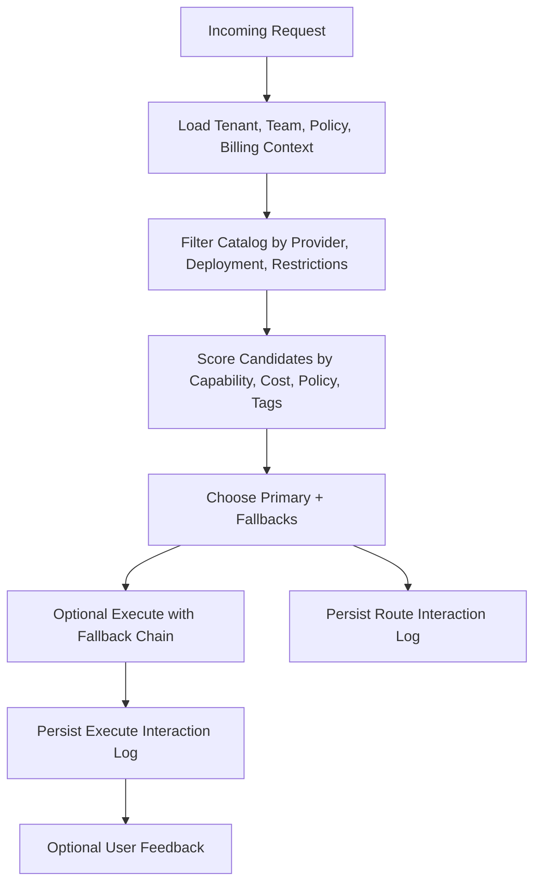

# Model Routing

CS Code Router chooses the best model for a request by combining cost, capability, policy, deployment preference, and runtime availability.

## What this page explains

Use this page if you want to understand why a route changed, why a fallback was chosen, or how the product balances cost and capability.

## What the router considers

Routing decisions are based on:

- task type such as `chat`, `code`, or `reasoning`
- prompt size and estimated token counts
- monthly budget and current spend pressure
- maximum request cost
- preferred deployment: `auto`, `cloud`, or `local`
- required capabilities
- tenant tags and policy rules
- provider availability
- enterprise restrictions
- conversation memory context

## Routing flow

1. Accept the request, auth context, and tenant scope.
2. Load policies, billing pressure, and team constraints.
3. Filter the model catalog by provider, deployment, and enterprise restrictions.
4. Score the remaining candidates.
5. Return the top-ranked model and a fallback chain.
6. Persist an interaction log for later optimization.



## Request example

```json
{
  "tenantId": "demo-company",
  "teamId": "team-platform",
  "taskType": "code",
  "prompt": "Refactor the webhook retry worker for clarity.",
  "preferredDeployment": "auto",
  "requiredCapabilities": ["chat", "code", "reasoning"],
  "tenantTags": ["cost-sensitive", "agent-mode"],
  "monthlyBudgetUsd": 300,
  "monthlySpendUsd": 141,
  "maxCostUsd": 0.08,
  "clientApplication": "cs-code-cli"
}
```

## Response example

```json
{
  "chosen": {
    "modelId": "gpt-4.1-mini",
    "label": "GPT-4.1 Mini",
    "provider": "openai",
    "deployment": "cloud",
    "estimatedCostUsd": 0.0021,
    "score": 8.73,
    "reasons": [
      "Matched required capabilities",
      "Stayed under request budget",
      "Higher score after policy adjustments"
    ]
  },
  "fallbacks": [
    {
      "modelId": "claude-3-5-haiku",
      "label": "Claude 3.5 Haiku",
      "provider": "anthropic",
      "deployment": "cloud",
      "estimatedCostUsd": 0.0025,
      "score": 8.11,
      "reasons": ["Fallback candidate"]
    }
  ],
  "interactionLogId": "interaction-123"
}
```

## What you see in the result

Every route response includes:

- the chosen model
- cost estimate
- reasons for selection
- fallback candidates
- evaluated policy IDs

That makes routing decisions inspectable in Studio, the API, and future optimization jobs.

## Fallback behavior

Execution uses the chosen model first, then walks the fallback chain if a provider fails or is unavailable.

Execution results record:

- whether fallback was used
- which model actually ran
- how many attempts were made
- the provider attempt log

## Conversation memory

If the request includes a conversation thread, the router can use:

- recent turns
- retrieved relevant turns
- a rolling summary
- a composed prompt preview

This lets the same thread survive model and deployment changes without losing the working context.

## Interaction logs

Every route and execute request now writes a structured interaction log containing:

- raw prompt
- composed prompt when memory was applied
- full route decision snapshot
- execution output or error
- latency and fallback telemetry
- user feedback when captured

This data is intended for future automated routing optimization and prompt rewriting workflows.

## Related docs

- [api-reference.md](api-reference.md)
- [workspace-reference.md](workspace-reference.md)
- [security-features.md](security-features.md)