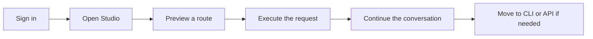

# Quickstart

This guide gets you from first sign-in to your first routed and executed request in a few minutes.

<DocsCallout title="Fastest path" tone="success">

Use the hosted product first. Once you can route and execute successfully in the app, move to the CLI or API only if you need automation.

</DocsCallout>

## What you'll do

You will move through this path:



## 1. Sign in to the app

Open the hosted workspace and sign in with your user account.

If your organization uses single sign-on, use the SSO entry point provided on the login screen.

## 2. Open Studio

Studio is the fastest place to understand the product.

Use it to:

- draft a prompt
- preview the selected route
- inspect fallback options and cost estimates
- execute and review the result

## 3. Preview a route

Create a prompt and run a route preview before execution.

You should see:

- the chosen provider and model
- fallback options
- estimated cost and token usage
- any policy or budget effects

## 4. Execute the request

Once the route looks right, execute it.

Execution returns the final output plus metadata about the model and fallback path used.

## 5. Continue the conversation

Conversations are stored server-side, so you can continue the same thread without losing context when models change.

## 6. Use the CLI when you need automation

Install from the hosted release:

```bash
curl -fsSL https://downloads.cs-code.com/cs-code/install.sh | bash
```

Then authenticate:

```bash
cs-code config set-url https://api.cs-code.com
cs-code login --oauth --tenant-id your-tenant-id
```

## 7. Call the API directly when needed

Example route request:

```bash
curl https://api.cs-code.com/v1/route \
  -H 'content-type: application/json' \
  -H 'x-api-key: cp_live_xxxxx' \
  -d '{
    "tenantId": "your-tenant-id",
    "taskType": "chat",
    "prompt": "Summarize the latest customer issue in five bullets.",
    "preferredDeployment": "auto"
  }'
```

<DocsCallout title="Use the right auth mode" tone="warn">

Use user sign-in or OAuth for people. Use API keys for automation and service-to-service traffic.

</DocsCallout>

## Where to go next

Then continue with:

- [user-guide.md](user-guide.md)
- [api-reference.md](api-reference.md)
- [cli-reference.md](cli-reference.md)
- [model-routing.md](model-routing.md)