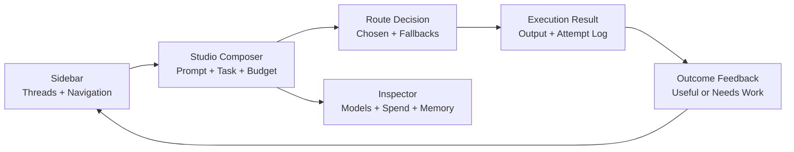

# Workspace Reference

The CS Code workspace is organized like a modern SaaS product: one shell, several focused surfaces, and a fast route-to-execution loop.

## Navigation model

Primary sections:

- Studio
- Teams
- Billing
- Ops
- Settings

The sidebar also anchors the conversation list, so routing sessions behave like resumable workspaces instead of isolated prompts.

## Studio

Studio is the main product surface.

Use it to:

- route requests before execution
- send prompts directly to the chosen model
- inspect fallback options and cost estimates
- continue the same thread across model switches
- attach outcome feedback for later routing optimization

### What appears in the Studio side panel

- highlighted models
- request and spend summary
- current route details
- memory context used for the latest decision
- execution feedback controls when a response has completed

## Persistent conversations

Conversations are stored server-side per user and tenant.

That means:

- switching models does not reset context
- re-opening a thread restores the same routing flow
- memory summaries and retrieved turns can be passed into later route and execute requests
- the latest execution can be rated as useful or needing work

## Teams

Teams groups work by collaboration scope and ownership.

Supported flows:

- create a team
- add members
- send invites
- review pending invites

## Billing

Billing provides:

- current subscription state
- included usage and remaining allowance
- invoice line items
- CSV export
- Stripe checkout and portal entry points

## Ops

Ops is the policies and activity surface.

Use it to manage:

- routing guardrails
- spend alerts
- webhook endpoints and secret rotation
- webhook deliveries and retries
- notifications and recent activity context

## Settings

Settings is user-scoped.

Current controls include:

- appearance mode
- default landing section

## Related docs

- [model-routing.md](model-routing.md)
- [security-features.md](security-features.md)
- [api-reference.md](api-reference.md)